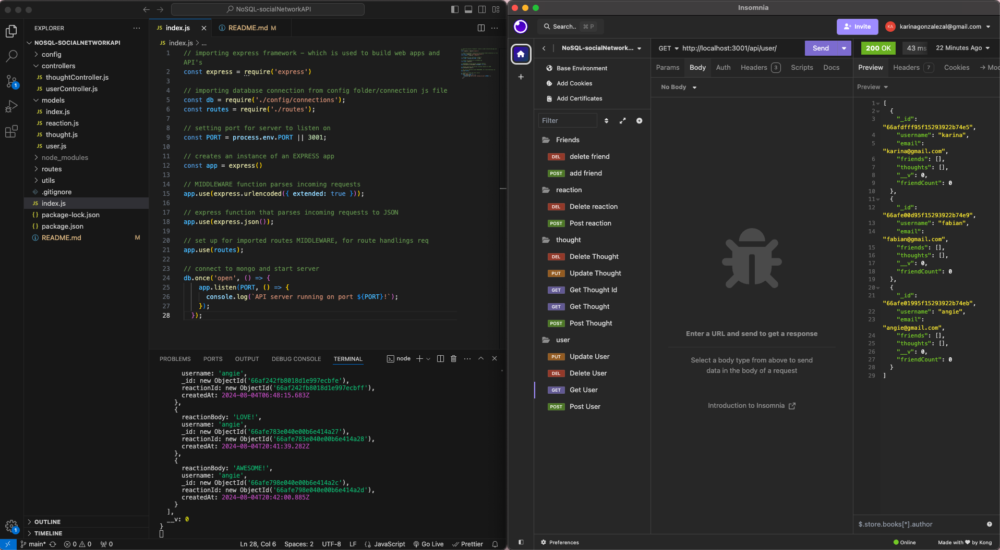

# NoSQL-socialNetworkAPI

## Description

This is a backend API with C R U D operations. The models used for this project include users, thoughts, reactions, and friends. This allows for handling and scaling social networking data using NoSQL, Node.js, and Mongoose. 

I learned how to use NoSQL and Mongoose to build a RESTful API with Node and Mongoose. Learning the difference between SQL and NoSQL has allowed me to better understand how they scale, models, and routing are different but similar. 

These route endpoints were testing using Insomnia as seen in the screenshot and walkthrough video below.

## Installation

- Clone repo from my github
- open in VS Code or preferred editor
- In the terminal run "node index.js"

## Usage

- Once repo is cloned and running, open Insomnia
- Test end points for adding, deleting, updating, and reading users, thoughts, reactions, and friends.

WALKTHROUGH VIDEO:
https://drive.google.com/file/d/1klKUzSNnKcdPouBKLKT7hIYBpcE9-_pL/view

## How to Contribute

EMAIL ME 📨📧 KARINAGONZALEZAL@GMAIL.COM